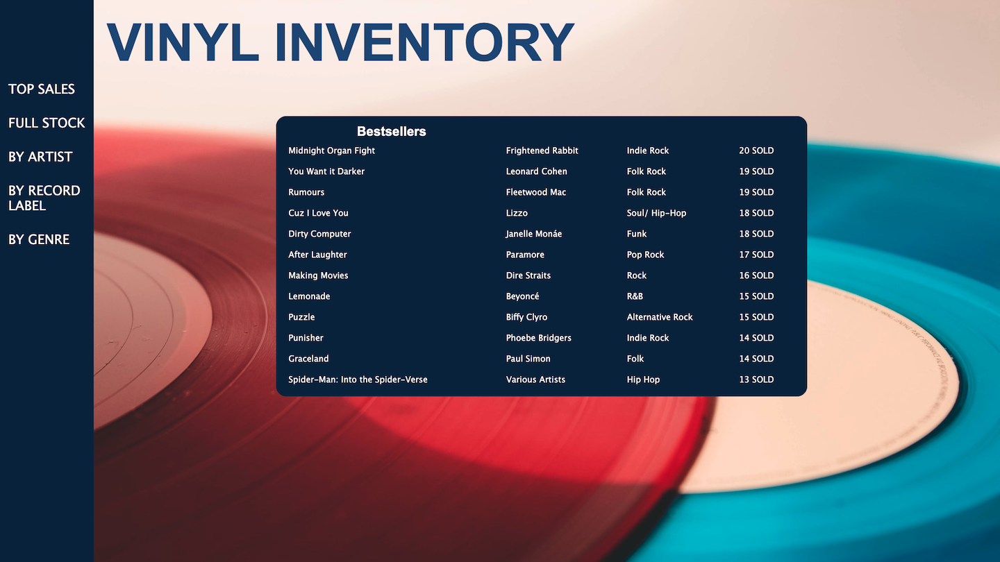
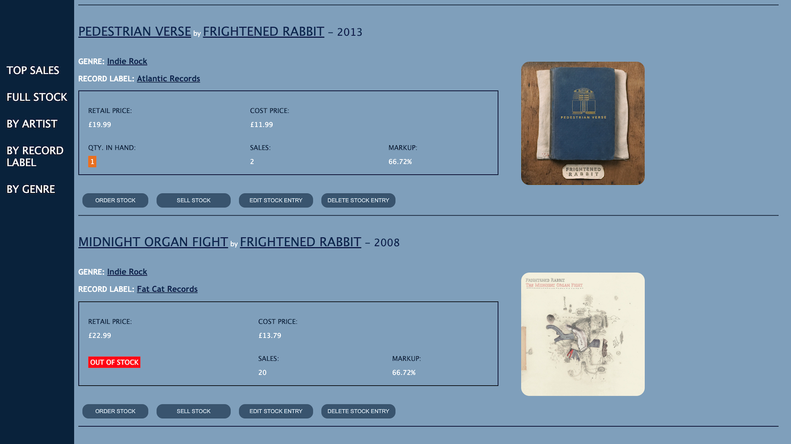
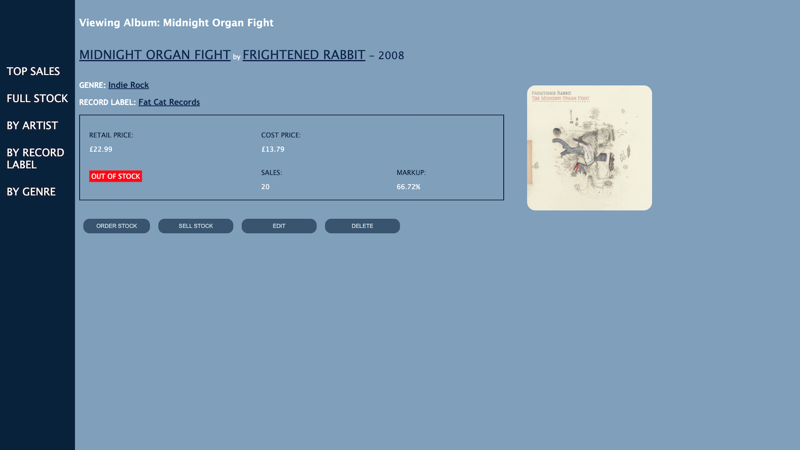

# Record Shop Inventory App

## Features  

* Shows shop inventory of Albums. Showing Album Title, Artist, Cover Art, Genre, Record Label, Price (Retail and Cost), Qty. in Hand, # of Sales, and Markup %.  
* User can view stock by a specific Artist, Record Label, or Genre.
* Colour indicates low Stock / low Markup % (Orange) and OUT OF STOCK (Red).  
* Ability to add new Artist/ Genre/ Label to database, and new Album to stock.  
* Edit and Delete buttons to Edit or Delete stock listing.  
* Order button simulates ordering stock - increases Qty. in Hand by 1.
* Sell button simulates selling stock - decrease Qty. in Hand by 1 and increase # of Sales by 1 for specific Album listing.
* Bestsellers (Top 12) table on home page - changes in relation to changes to # of Sales.  

---
 
  
### Top Sales / Home Page

   

---

### Inventory Page View  

  
 
 ---

### Specific Album Stock View

   
 
 ## Running the App  

In terminal:  

```` 
createdb stock_manager  
psql -d stock_manager -f db/stock_manager.sql  
python3 console.py  
flask run
````

## Technology Used

* Python
* Flask
* Postgresql
